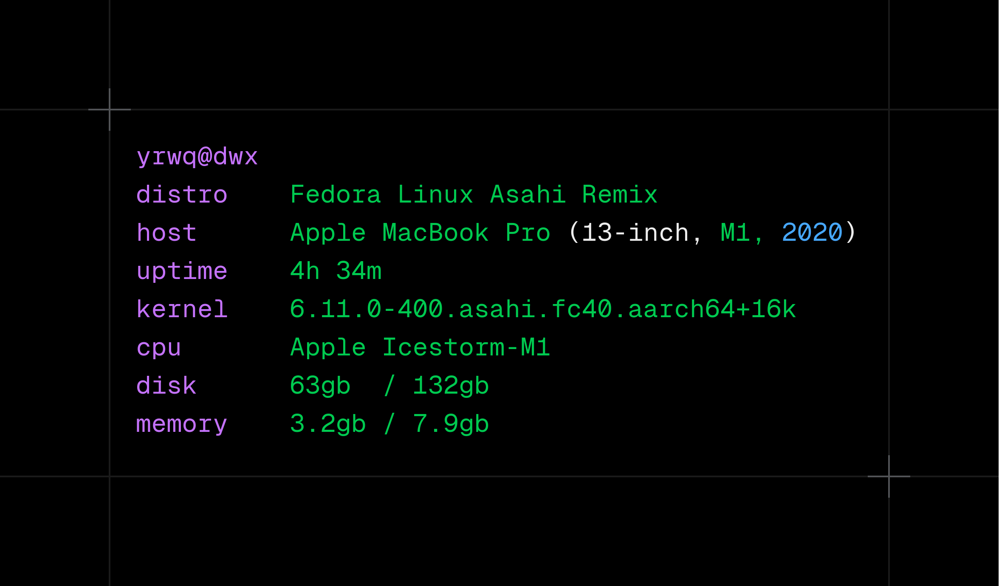

<p align="center">
  
</p>

<h4 align="center">Yafetch is a minimal command line system information tool written in Rust and configured in Lua. </h4>

## installation

```bash
brew install pkarpovich/apps/yafetch
mkdir -p ~/.config/yafetch
curl -o ~/.config/yafetch/init.lua https://raw.githubusercontent.com/pkarpovich/yafetch/main/examples/sample.lua
```

from source:

```bash
git clone https://github.com/pkarpovich/yafetch && cd yafetch
cargo install --path .
mkdir -p ~/.config/yafetch
cp examples/sample.lua ~/.config/yafetch/init.lua
```

## usage

```
yafetch [<config>]     render a configuration, ~/.config/yafetch/init.lua by default
yafetch -V, --version  print the version and exit
yafetch -h, --help     print this message and exit
```

yafetch is extensible in lua, the default location for the configuration file is `~/.config/yafetch/init.lua`.
A run with no configuration there, an unreadable one, or lua that does not load, says so on stderr and
exits non-zero rather than panicking.

## configuration

## releasing

bump `version` in `Cargo.toml`, merge, then push a matching tag:

```bash
git tag -a v0.3.0 -m "yafetch 0.3.0"
git push origin v0.3.0
```

the release workflow refuses a tag that disagrees with `Cargo.toml`, runs the same `mise run check` gate as CI, builds for Apple Silicon, signs the binary with the Developer ID certificate under the hardened runtime, notarizes it, publishes the GitHub release with the zip and its checksum, and rewrites `Casks/yafetch.rb` in `pkarpovich/homebrew-apps`. secrets it needs: `MACOS_CERT_P12_BASE64`, `MACOS_CERT_PASSWORD`, `MACOS_TEAM_ID`, `ASC_KEY_ID`, `ASC_ISSUER_ID`, `ASC_KEY_CONTENT`, `HOMEBREW_TAP_TOKEN`.
